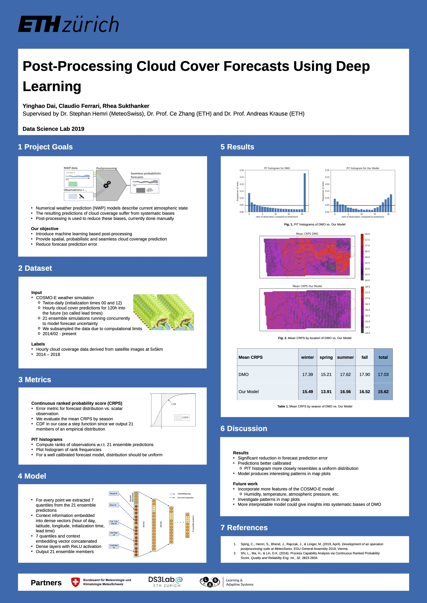

# DSLAB2019_MeteoSwissCloud

## Project Description
This was a three month project, set up as part of the Data Science Lab course at ETH Zurich in the Fall of 2019. It was supervised jointly by <b> Dr. Stephan Hemri from MeteoSwiss, Professor Ce Zhang and Professor Andreas Krause (both from ETH) </b>.

## Goal
MeteoSwiss' [COSMO](https://www.meteoswiss.admin.ch/home/measurement-and-forecasting-systems/warning-and-forecasting-systems/cosmo-forecasting-system.html) numerical weather prediction (NWP) system produces an ensemble of hourly forecasts every point on a grid over the map of Switzerland. This project aims to post-process the forecasts using Machine Learning to specifically predict cloud coverage. The prediction needs to be both accurate and well calibrated, meaning it should also give accurate uncertainty measurements.

## Poster

## People
This project was done by Rhea Sukthanker, Yinghao Dai and Claudio Ferrari.
